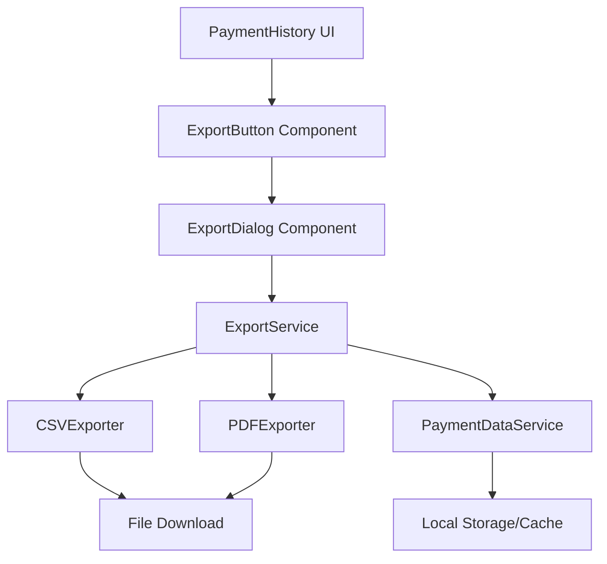

# Design Document: Payment History Export

## Overview

The payment history export feature enables users to export their payment transaction data in CSV and PDF formats. The implementation follows a client-side architecture that integrates with the existing React/TypeScript payment application, leveraging existing payment history data and services.

The design prioritizes:
- Client-side processing for data privacy and security
- Offline capability using cached payment data
- Internationalization support for multi-language exports
- Professional formatting for both CSV and PDF outputs
- Seamless integration with existing payment history UI

## Architecture

### High-Level Architecture



### Component Responsibilities

1. **ExportButton Component**: Triggers the export flow from the payment history page
2. **ExportDialog Component**: Provides UI for format selection and date range filtering
3. **ExportService**: Orchestrates the export process, coordinates data fetching and formatting
4. **CSVExporter**: Generates CSV formatted output from payment data
5. **PDFExporter**: Generates PDF formatted output from payment data
6. **PaymentDataService**: Retrieves and filters payment history data
7. **FileDownloadUtil**: Handles browser file download functionality

### Technology Stack

- **CSV Generation**: Custom implementation or papaparse library
- **PDF Generation**: jsPDF library with jspdf-autotable for table formatting
- **Date Handling**: date-fns for date formatting and validation
- **Internationalization**: Existing i18n infrastructure (react-i18next)
- **File Download**: Browser Blob API and URL.createObjectURL

## Components and Interfaces

### ExportButton Component

```typescript
interface ExportButtonProps {
  disabled?: boolean;
  className?: string;
}

// Renders a button that opens the export dialog
// Integrates into existing PaymentHistoryList component
```

### ExportDialog Component

```typescript
interface ExportDialogProps {
  open: boolean;
  onClose: () => void;
  onExport: (options: ExportOptions) => Promise<void>;
}

interface ExportOptions {
  format: 'csv' | 'pdf';
  dateRange?: {
    startDate: Date;
    endDate: Date;
  };
}

// Provides UI for:
// - Format selection (CSV/PDF radio buttons)
// - Optional date range picker
// - Export button with loading state
// - Error display
```

### ExportService

```typescript
interface ExportService {
  exportPaymentHistory(options: ExportOptions): Promise<void>;
}

interface PaymentTransaction {
  id: string;
  date: Date;
  amount: number;
  currency: string;
  status: string;
  description: string;
  merchant: string;
  category?: string;
}

interface ExportMetadata {
  exportDate: Date;
  totalTransactions: number;
  dateRange?: {
    startDate: Date;
    endDate: Date;
  };
  isOffline: boolean;
  language: string;
}

// Main orchestration service:
// 1. Validates export options
// 2. Fetches and filters payment data
// 3. Delegates to appropriate exporter (CSV/PDF)
// 4. Triggers file download
// 5. Handles errors and user feedback
```

### CSVExporter

```typescript
interface CSVExporter {
  generate(
    transactions: PaymentTransaction[],
    metadata: ExportMetadata,
    locale: string
  ): string;
}

// Generates CSV content:
// - Header row with localized column names
// - Data rows with proper escaping
// - UTF-8 encoding
// - ISO 8601 date format
// - Decimal number format for amounts
```

### PDFExporter

```typescript
interface PDFExporter {
  generate(
    transactions: PaymentTransaction[],
    metadata: ExportMetadata,
    locale: string
  ): Blob;
}

// Generates PDF content:
// - Header with metadata (title, export date, date range)
// - Table with formatted transaction data
// - Currency symbols and proper number formatting
// - Page numbers on multi-page documents
// - Professional styling
```

### PaymentDataService

```typescript
interface PaymentDataService {
  getPaymentHistory(filters?: PaymentFilters): Promise<PaymentTransaction[]>;
  isOffline(): boolean;
}

interface PaymentFilters {
  startDate?: Date;
  endDate?: Date;
}

// Retrieves payment data:
// - Fetches from existing payment history service
// - Applies date range filtering
// - Handles offline mode (cached data)
// - Returns sorted transactions (chronological)
```

### FileDownloadUtil

```typescript
interface FileDownloadUtil {
  downloadFile(content: string | Blob, filename: string, mimeType: string): void;
}

// Handles file download:
// - Creates Blob from content
// - Generates download URL
// - Triggers browser download
// - Cleans up resources
```

## Data Models

### PaymentTransaction

```typescript
interface PaymentTransaction {
  id: string;                    // Unique transaction identifier
  date: Date;                    // Transaction date/time
  amount: number;                // Transaction amount (decimal)
  currency: string;              // ISO 4217 currency code (e.g., "USD")
  status: string;                // Transaction status (e.g., "completed", "pending")
  description: string;           // Transaction description
  merchant: string;              // Merchant or recipient name
  category?: string;             // Optional transaction category
  paymentMethod?: string;        // Optional payment method
  reference?: string;            // Optional reference number
}
```

### ExportOptions

```typescript
interface ExportOptions {
  format: 'csv' | 'pdf';         // Export format
  dateRange?: {                  // Optional date range filter
    startDate: Date;             // Start date (inclusive)
    endDate: Date;               // End date (inclusive)
  };
}
```

### ExportMetadata

```typescript
interface ExportMetadata {
  exportDate: Date;              // When export was generated
  totalTransactions: number;     // Number of transactions in export
  dateRange?: {                  // Date range if filtered
    startDate: Date;
    endDate: Date;
  };
  isOffline: boolean;            // Whether generated offline
  language: string;              // Language code (e.g., "en", "es")
}
```

### CSV Format Structure

```
Transaction ID,Date,Amount,Currency,Status,Description,Merchant,Category
TXN001,2024-01-15,150.00,USD,completed,Office supplies,Office Depot,Business
TXN002,2024-01-16,45.50,USD,completed,Lunch meeting,Restaurant ABC,Meals
```

### PDF Format Structure

```
Payment History Export
Export Date: January 20, 2024
Period: January 1, 2024 - January 31, 2024
Total Transactions: 25

┌──────────────┬────────────┬──────────┬──────────┬───────────┬─────────────────┬──────────────┐
│ Transaction  │    Date    │  Amount  │ Currency │  Status   │   Description   │   Merchant   │
├──────────────┼────────────┼──────────┼──────────┼───────────┼─────────────────┼──────────────┤
│ TXN001       │ 2024-01-15 │ $150.00  │   USD    │ Completed │ Office supplies │ Office Depot │
│ TXN002       │ 2024-01-16 │  $45.50  │   USD    │ Completed │ Lunch meeting   │ Restaurant   │
└──────────────┴────────────┴──────────┴──────────┴───────────┴─────────────────┴──────────────┘

Page 1 of 2
```


## Correctness Properties

A property is a characteristic or behavior that should hold true across all valid executions of a system—essentially, a formal statement about what the system should do. Properties serve as the bridge between human-readable specifications and machine-verifiable correctness guarantees.

### Property 1: Format Validation

*For any* format selection input, the Export_Service should validate whether it is a supported format ('csv' or 'pdf') before proceeding with export generation.

**Validates: Requirements 1.2**

### Property 2: Dual Format Support

*For any* payment transaction dataset, the Export_Service should successfully generate exports in both CSV and PDF formats without data loss.

**Validates: Requirements 1.3**

### Property 3: Export Data Completeness

*For any* transaction in the export, all required fields (transaction ID, date, amount, currency, status, description, merchant) and export metadata (export date, total count, online/offline status) should be present in the generated output.

**Validates: Requirements 2.1, 2.2, 2.4**

### Property 4: Chronological Order Preservation

*For any* list of transactions sorted chronologically, the export should preserve the same chronological order in the output.

**Validates: Requirements 2.3**

### Property 5: Date Range Filtering

*For any* date range filter and transaction list, the export should include only transactions where the transaction date falls within the specified range (inclusive).

**Validates: Requirements 3.1**

### Property 6: Invalid Date Range Handling

*For any* invalid date range (where end date is before start date, or dates are malformed), the Export_Service should return a descriptive error message and not generate an export.

**Validates: Requirements 3.2**

### Property 7: CSV Header Row

*For any* CSV export, the first row should contain column headers with localized names for all transaction fields.

**Validates: Requirements 4.1**

### Property 8: CSV Special Character Escaping

*For any* transaction data containing special CSV characters (commas, quotes, newlines), the CSV export should properly escape these characters to prevent parsing errors.

**Validates: Requirements 4.2**

### Property 9: CSV UTF-8 Encoding

*For any* CSV export containing international characters (non-ASCII), the characters should be preserved correctly using UTF-8 encoding.

**Validates: Requirements 4.3**

### Property 10: CSV Date Format

*For any* date value in a CSV export, it should be formatted in ISO 8601 format (YYYY-MM-DD).

**Validates: Requirements 4.4**

### Property 11: CSV Currency Format

*For any* currency amount in a CSV export, it should be formatted as a decimal number without currency symbols.

**Validates: Requirements 4.5**

### Property 12: PDF Metadata Header

*For any* PDF export, the document should contain a header section with export metadata including export date, date range (if filtered), and total transaction count.

**Validates: Requirements 5.1**

### Property 13: PDF Multi-Page Numbering

*For any* PDF export that spans multiple pages, each page should include a page number indicator.

**Validates: Requirements 5.3**

### Property 14: PDF Currency Formatting

*For any* currency amount in a PDF export, it should be formatted with the appropriate currency symbol based on the currency code.

**Validates: Requirements 5.4**

### Property 15: Download Filename Format

*For any* export, the generated download filename should include both the export format (csv/pdf) and the export date.

**Validates: Requirements 6.1, 6.2**

### Property 16: Localized Export Headers

*For any* supported language setting, the export should use that language for all headers, labels, and UI text while preserving transaction data in its original language.

**Validates: Requirements 7.1, 7.2, 7.3**

### Property 17: Offline Status Metadata

*For any* export, the metadata should accurately indicate whether the export was generated in online or offline mode.

**Validates: Requirements 8.3**

### Property 18: Loading Indicator Display

*For any* export operation, a loading indicator should be displayed to the user during the generation process.

**Validates: Requirements 9.1**

### Property 19: Success Feedback

*For any* successfully completed export, a success message should be displayed to the user.

**Validates: Requirements 9.3**

### Property 20: Error Feedback

*For any* failed export operation, a descriptive error message with recovery suggestions should be displayed to the user.

**Validates: Requirements 9.4**

### Property 21: No Export File Persistence

*For any* export operation, after the download is triggered, no generated export files should remain cached or stored in the application.

**Validates: Requirements 10.2**

### Property 22: Authorization-Based Data Access

*For any* authenticated user, exports should contain only transaction data that the user is authorized to access.

**Validates: Requirements 10.3**

## Error Handling

### Validation Errors

- **Invalid Format Selection**: Return error message "Please select a valid export format (CSV or PDF)"
- **Invalid Date Range**: Return error message "End date must be after start date"
- **Malformed Dates**: Return error message "Please provide valid dates in the format YYYY-MM-DD"

### Data Errors

- **No Transactions Available**: Display message "No transactions found for the selected period"
- **Incomplete Offline Data**: Display warning "You are offline. The export may not include all transactions."
- **Missing Required Fields**: Log error and skip malformed transactions, notify user of incomplete export

### Export Generation Errors

- **CSV Generation Failure**: Display error "Failed to generate CSV export. Please try again."
- **PDF Generation Failure**: Display error "Failed to generate PDF export. Please try again."
- **Memory Errors**: Display error "Export too large. Please try a smaller date range."

### Download Errors

- **Download Blocked**: Display error "Download was blocked. Please check your browser settings."
- **File System Error**: Display error "Failed to save file. Please check your device storage."

### Error Recovery

- All errors should be logged for debugging
- User should be able to retry the export after an error
- Form state should be preserved after errors
- Provide actionable recovery suggestions in error messages

## Testing Strategy

### Dual Testing Approach

This feature will use both unit testing and property-based testing to ensure comprehensive coverage:

- **Unit tests**: Verify specific examples, edge cases, and error conditions
- **Property tests**: Verify universal properties across all inputs

Unit tests focus on specific scenarios like empty transaction lists, specific date ranges, and error conditions. Property-based tests verify that correctness properties hold across randomly generated inputs, catching edge cases that might be missed by example-based tests.

### Property-Based Testing

We will use **fast-check** (for TypeScript/JavaScript) as the property-based testing library. Each property test will:

- Run a minimum of 100 iterations with randomly generated inputs
- Reference the corresponding design document property
- Use the tag format: **Feature: payment-history-export, Property {number}: {property_text}**

Example property test structure:

```typescript
// Feature: payment-history-export, Property 4: Chronological Order Preservation
test('exported transactions preserve chronological order', () => {
  fc.assert(
    fc.property(
      fc.array(arbitraryTransaction()),
      (transactions) => {
        const sorted = sortByDate(transactions);
        const exported = exportService.export(sorted, { format: 'csv' });
        const exportedDates = parseExportedDates(exported);
        return isChronological(exportedDates);
      }
    ),
    { numRuns: 100 }
  );
});
```

### Unit Testing

Unit tests will cover:

- Specific examples demonstrating correct behavior
- Edge cases (empty lists, single transaction, very large exports)
- Error conditions (invalid inputs, offline mode, missing data)
- Integration between components
- UI interactions and user feedback

### Test Coverage Goals

- 100% coverage of all correctness properties via property-based tests
- 90%+ code coverage via combined unit and property tests
- All error handling paths tested
- All user-facing messages tested for localization
- Offline mode scenarios tested

### Testing Tools

- **Jest**: Test runner and assertion library
- **React Testing Library**: Component testing
- **fast-check**: Property-based testing
- **MSW (Mock Service Worker)**: API mocking for offline scenarios
